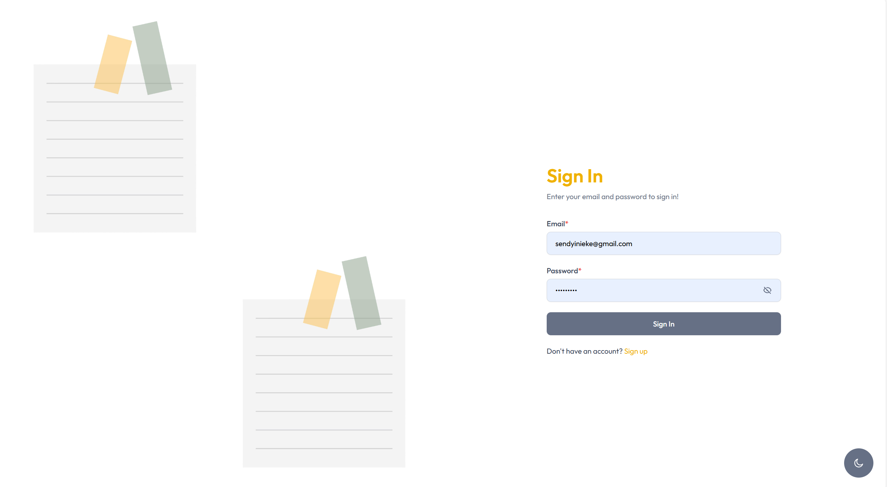
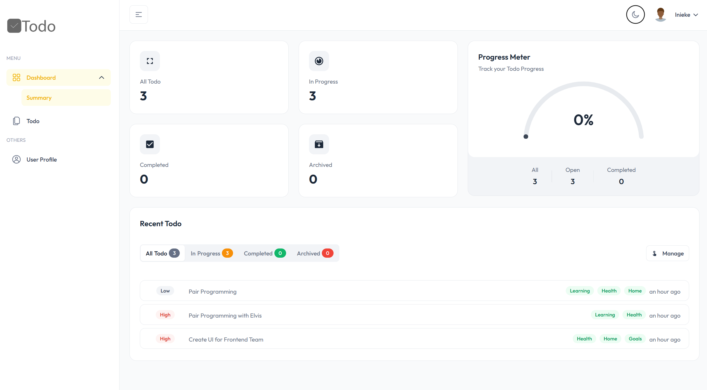
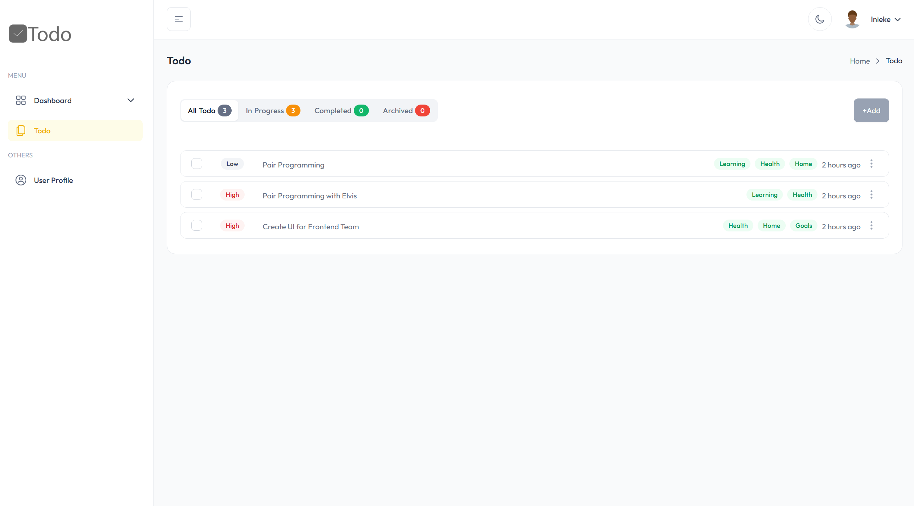
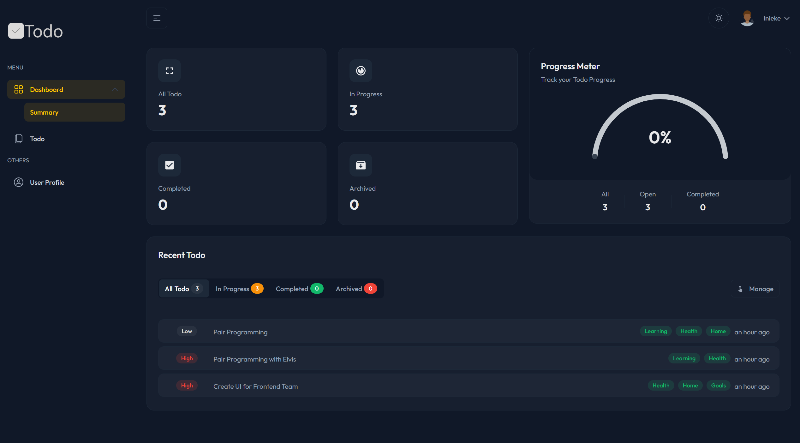

# TodoApp - Full Stack Project Documentation

## Table of Contents

1. [Project Overview](#project-overview)
2. [Tech Stack](#tech-stack)
3. [Folder Structure](#folder-structure)
4. [Deployment Guide (Windows & Linux)](#deployment-guide-windows--linux)
5. [Development Information)](#deployment-guide-windows--linux)
6. [Backend (TodoAppApi)](#backend-todoappapi)
7. [Frontend (TodoAppWeb)](#frontend-todoappweb)
8. [Database](#database)
9. [API Security](#api-security)
10. [Logging](#logging)
11. [API Documentation](#api-documentation)
12. [Testing](#testing)
13. [Environment Configuration](#environment-configuration)
14. [Using the Application](#using-the-application)
15. [Managing Change, Deployment & Versioning](#managing-change-deployment--versioning)
16. [Developer Acknowledgement](#developer-acknowledgement)
17. [GitHub Repository](#github-repository)
18. [Future Enhancements](#future-enhancements)
19. [Screenshots and UI Previews](#screenshots-and-ui-previews)

---

## Project Overview

**TodoApp** is a full-stack task management application that allows users to register, authenticate, manage their profile, and organize tasks via an intuitive UI. It is built using modern technologies including .NET 9, ReactJS with Redux Toolkit, PostgreSQL, and deployed via Docker.

---

## Tech Stack

**Frontend:**

- ReactJS (with Vite)
- Redux Toolkit (for state management)
- TailwindCSS (for styling)

**Backend:**

- ASP.NET Core 9
- Entity Framework Core
- AutoMapper
- Serilog
- JWT Authentication
- Scalar for OpenAPI Documentation

**Database:**

- PostgreSQL

**Testing:**

- xUnit
- Moq
- FluentAssertions
- EF Core InMemory

**Deployment:**

- Docker & Docker Compose
- NGINX for frontend hosting

---

## Folder Structure

```
TodoApp
├── TodoAppApi
│   ├── Program.cs
│   ├── AppConfig.cs
│   ├── Controllers/
│   ├── Entities/
│   ├── Infrastructure/
│   ├── Repositories/
│   ├── Services/
│   └── ...
├── TodoAppWeb
│   ├── src/
│   ├── main.ts
│   ├── App.tsx
│   ├── index.css
│   ├── package.json
│   └── ...
├── TodoAppApi.test
├── docker-compose.yml
├── .dockerignore
├── .gitignore
```

---

## Deployment Guide (Windows & Linux)

### Prerequisites

To deploy and run the application, ensure the following tools are installed:

### ✅ Docker & Docker Compose

### ✅ Git

---

### 🛠️ Windows Installation Guide

#### 🐳 Docker & Docker Compose

1. Download **Docker Desktop** from the official site:\
   [https://www.docker.com/products/docker-desktop](https://www.docker.com/products/docker-desktop)

2. Install it and **enable WSL 2** during setup.

   - Install **WSL 2** by running:
     ```powershell
     wsl --install
     ```

3. After installation, open Docker Desktop and ensure it’s running.

4. Docker Compose is bundled with Docker Desktop (v2+), so no extra steps needed.

#### ♻️ Verify Docker & Compose Installation:

```bash
docker --version
docker compose version
```

#### 🛠️ Git for Windows

1. Download from:\
   [https://git-scm.com/download/win](https://git-scm.com/download/win)

2. Install and choose default options during setup.

3. Open Git Bash or PowerShell and verify:

```bash
git --version
```

---

### 🐧 Linux Installation Guide (Ubuntu/Debian)

#### 🐳 Docker Engine

```bash
sudo apt update
sudo apt install -y ca-certificates curl gnupg lsb-release

# Add Docker’s official GPG key
sudo mkdir -p /etc/apt/keyrings
curl -fsSL https://download.docker.com/linux/ubuntu/gpg | \
  sudo gpg --dearmor -o /etc/apt/keyrings/docker.gpg

# Set up the repository
echo \
  "deb [arch=$(dpkg --print-architecture) \
  signed-by=/etc/apt/keyrings/docker.gpg] \
  https://download.docker.com/linux/ubuntu \
  $(lsb_release -cs) stable" | \
  sudo tee /etc/apt/sources.list.d/docker.list > /dev/null

# Install Docker
sudo apt update
sudo apt install -y docker-ce docker-ce-cli containerd.io
```

#### ↺ Enable & Start Docker

```bash
sudo systemctl enable docker
sudo systemctl start docker
```

#### 🧱 Docker Compose (Plugin)

```bash
sudo apt install docker-compose-plugin
```

#### ♻️ Verify:

```bash
docker --version
docker compose version
```

#### 🛠️ Git

```bash
sudo apt update
sudo apt install git
```

#### ♻️ Verify:

```bash
git --version
```

---

### 1. Clone the Repository

```bash
git clone https://github.com/uisendy/TodoApp.git
cd TodoApp
```

### 2. Add Environment Configuration to To

```bash
cd /TodoAppApi
```

Ensure the following environment variables or `appsettings.json` are correctly set:

```json
{
  "Jwt": {
    "Secret": "your-secret",
    "Issuer": "TodoApp",
    "Audience": "TodoAppUsers"
  },
  "ConnectionStrings": {
    "DefaultConnection": "Host=postgres;Database=todo_db;Username=postgres;Password=postgres"
  },
  "Serilog": {
    "Using": ["Serilog.Sinks.Console", "Serilog.Sinks.File"],
    "MinimumLevel": {
      "Default": "Information",
      "Override": {
        "Microsoft": "Warning",
        "System": "Warning"
      }
    },
    "WriteTo": [
      {
        "Name": "Console"
      },
      {
        "Name": "File",
        "Args": {
          "path": "Logs/log-.txt",
          "rollingInterval": "Day",
          "outputTemplate": "[{Timestamp:yyyy-MM-dd HH:mm:ss} {Level:u3}] {SourceContext} {Message:lj}{NewLine}{Exception}"
        }
      }
    ],
    "Enrich": ["FromLogContext", "WithMachineName", "WithThreadId"],
    "Properties": {
      "Application": "TodoAppApi"
    }
  },
  "AllowedHosts": "*"
}
```

```bash
cd ..
```

### 3. Run with Docker Compose

```bash
docker-compose up --build -d
```

### 4. Access the Application

- Frontend: `http://localhost:5000`
- Backend API: `http://localhost:5500`
- scalar Docs: `http://localhost:5500/scalar`

## Using the Application

1. Start services with Docker: `docker-compose up --build`
2. Visit `http://localhost:5000`
3. Register or login
4. Use dashboard to manage todos
5. Update profile settings

---

### Docker Services - Minimal

```yaml
postgres:
  ports: '5432:5432'
todoapp_api:
  ports: '5500:8080'
todoapp_ui:
  ports: '5000:80'
volumes:
  postgres_data:
networks:
  todoapp_network:
    driver: bridge
```

### 5. Clean and Restart (Optional)

```bash
docker-compose down -v
```

---

## Development Information

---

## Backend (TodoAppApi)

### Features

- Modular architecture with DI, repositories, services, DTOs.
- JWT Authentication and custom token validation middleware.
- API Versioning using `Asp.Versioning`.
- AutoMapper for DTO mapping.
- Serilog logging to both Console and File.

### Key Middlewares

- `TokenHeaderFilter`
- `Logging Middleware`
- `JwtAuthenticationEvents`

### API Initialization Flow

```csharp
app.UseAuthentication();
app.UseAuthorization();
app.MapControllers();
```

### Seeding

```csharp
using (var scope = app.Services.CreateScope())
{
    var dbContext = scope.ServiceProvider.GetRequiredService<AppDbContext>();
    await DbSeeder.SeedAsync(dbContext);
}
```

---

## Frontend (TodoAppWeb)

### Features

- Built with ReactJS using Vite for fast bundling.
- Redux Toolkit for state management.
- Custom styling with TailwindCSS.
- Responsive and mobile-friendly UI.

### Build Instructions

```bash
npm install
npm run dev          # development
npm run build        # production
```

### NGINX Config

```nginx
server {
  listen 80;
  root /usr/share/nginx/html;
  index index.html;

  location / {
    try_files $uri /index.html;
  }
}
```

---

## Database

### PostgreSQL

- Version: `postgres:15`
- Database: `todo_db`
- User: `postgres`
- Password: `postgres`
- Volume mount: `postgres_data:/var/lib/postgresql/data`

---

## API Security

### JWT Token

- Issuer, Audience, and Secret set via environment variables or appsettings.
- Configured in `Program.cs` with strict token validation.

---

## Logging

### Serilog

- Logs output to both Console and rolling File logs in `/Logs`.
- Rolling log file pattern: `log-.txt`

```csharp
Log.Logger = new LoggerConfiguration()
    .WriteTo.Console()
    .WriteTo.File("Logs/log-.txt", rollingInterval: RollingInterval.Day)
    .CreateLogger();
```

---

## API Documentation

- Auto-generated with Scalar.
- Available via `/scalar` when running in development or Docker mode.

---

## Testing

### Unit Testing

- Test project: `TodoAppApi.test`
- Frameworks: `xUnit`, `Moq`, `FluentAssertions`, `EFCore.InMemory`

### Sample Test Snippet

```csharp
[Fact]
public async Task Should_Update_User_Profile()
{
    // Arrange...
    // Act...
    // Assert...
}
```

---

## Deployment: Docker

### docker-compose.yml

```yaml
services:
  postgres:
    image: postgres:15
    ports:
      - '5432:5432'
    volumes:
      - postgres_data:/var/lib/postgresql/data

  todoapp_api:
    build:
      context: .
      dockerfile: TodoAppApi/Dockerfile
    ports:
      - '5500:8080'
    depends_on:
      - postgres

  todoapp_ui:
    build:
      context: ./todoAppWeb
    ports:
      - '5000:80'
    depends_on:
      - todoapp_api

volumes:
  postgres_data:
```

### Commands

```bash
docker-compose up --build
```

---

## Managing Change, Deployment & Versioning

- **Git Workflow:** Use feature branches → PR → Merge to `main`
- **CI/CD:** Use GitHub Actions for build, test, and deployment pipelines
- **Versioning:** API Versioning via URL segments (e.g., `/v1/users`)
- **Tagging Releases:** Use `git tag v1.0.0` and changelogs
- **Deployment Environments:** `Development`, `Docker`, `Production`

---

## Developer Acknowledgement

- **LinkedIn:** [https://linkedin.com/in/sendyinieke](https://linkedin.com/in/sendyinieke)
- **GitHub:** [https://github.com/uisendy](https://github.com/uisendy)
- **X (Twitter):** [https://x.com/sendy.iu](https://x.com/sinieke)

---

## GitHub Repository

> [🔗 [GitHub](https://github.com/uisendy/TodoApp.git)]

---

## Future Enhancements

- OAuth Integration (Google, GitHub)
- Real-time updates with SignalR
- Task reminders via Email
- Role-based Access Control

---

## Screenshots and UI Previews

> 📸
>  >  > 



---

**End of Documentation**
